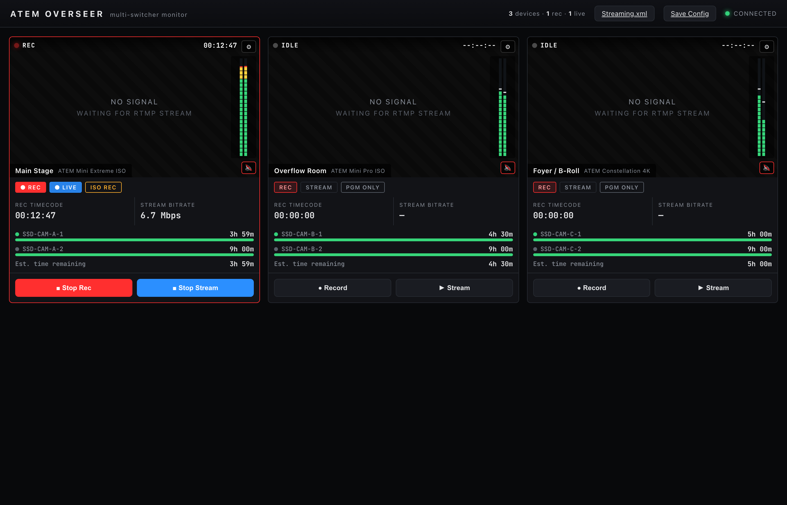
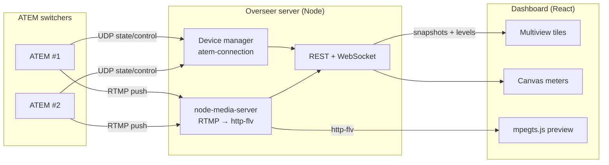

# Atem Overseer

> **AI-assisted project.** This codebase was created with [Claude Code](https://claude.com/claude-code)
> (Anthropic), directed and reviewed by a human author. It was developed and
> verified end-to-end against a built-in simulated switcher fleet (`--mock`), and
> has **not yet** been run against live ATEM hardware. Validate transport,
> streaming and media-upload behaviour against your own switchers before relying
> on it for a live show.

A browser-based dashboard for monitoring — and controlling — a fleet of
Blackmagic ATEM switchers from one screen, styled after Blackmagic's own
multiviewer.



*The dashboard running the built-in `--mock` fleet: one tile per switcher with
record/stream status, live program-audio meters, drive time-remaining, ISO/PGM
mode and transport controls.*



Point it at any number of ATEMs on your network and get, per device:

- **Record & stream status** with live timecode and a tally-red tile border when rolling
- **Drive capacity / estimated time remaining** per disk, with working-set and low/critical warnings
- **ISO vs PGM-only** record-mode indicator (and toggle)
- **Stereo program audio metering** (Fairlight levels, peak-hold) that runs at display rate
- **Live output preview** — the ATEM streams to Overseer's bundled RTMP ingest and plays back in the tile with no transcode
- **Per-device audio monitoring** you can mute/un-mute independently, so you listen to one wall at a time
- **Remote transport** — start/stop record and stream from the browser

Behind each tile's ⚙ (gear):

- **Streaming.xml generator** — drop it into ATEM Software Control (or apply the service to a switcher directly) so the ATEM streams to Overseer
- **Config XML save / load** for the monitored fleet
- **Media pool upload** (any image, converted to the switcher's native RGBA in-browser) and **media-player assignment**

---

## Architecture

```
 ATEM switchers ──UDP(atem-connection)──┐
        │                               │
        └──RTMP push (Streaming.xml)──┐ │
                                      ▼ ▼
                            ┌───────────────────────┐
                            │   Overseer server     │
                            │  • device manager     │
                            │  • node-media-server  │  RTMP:1935  →  http-flv:8000
                            │  • REST + WebSocket    │
                            └───────────┬───────────┘
                                        │  WS: snapshots + batched audio levels
                                        ▼
                            ┌───────────────────────┐
                            │  Web dashboard (React) │  mpegts.js plays the http-flv feed
                            │  BMD multiview tiles   │  canvas meters @ display rate
                            └───────────────────────┘
```

- **`packages/server`** — Node + TypeScript. Wraps [`atem-connection`](https://www.npmjs.com/package/atem-connection) for each device, normalizes state into a UI-friendly model, and fans it out over WebSocket. Bundles [`node-media-server`](https://www.npmjs.com/package/node-media-server) so each switcher's RTMP stream is re-served as low-latency http-flv. REST for commands, config, and media upload.
- **`packages/web`** — Vite + React + TypeScript. The multiview dashboard; [`mpegts.js`](https://www.npmjs.com/package/mpegts.js) for playback.

The stream key **is** the device id — that's how a published RTMP stream is matched to its tile.

## Quick start

```bash
npm install

# no hardware? run the simulated 3-switcher fleet:
npm run dev:mock          # dashboard at http://localhost:4700

# real devices — copy the example, edit addresses, then:
cp atem-overseer.config.example.json atem-overseer.config.json
npm run build
npm start
```

Set `publicHost` to the IP the ATEMs (and browsers) reach this machine at — it's
baked into the generated `Streaming.xml` and the http-flv playback URLs.

### Wiring up live preview

1. Open a tile's ⚙ → **Download Streaming.xml**, and place it in ATEM Software
   Control's streaming support folder (or hit **Apply local service to switcher**
   to push the RTMP URL directly over the protocol).
2. Set the switcher's stream key to its Overseer device id (listed in the XML).
3. Start streaming — the feed appears in the tile.

## Desktop app

Prefer a one-click app over `npm`? The [`launcher/`](launcher/) directory wraps
Overseer in the fleet's [av-launcher](https://github.com/allansargeant/av-launcher)
tray shell — a small native menu-bar app (Tauri v2) that embeds a Node runtime
and the whole app, so nothing needs to be installed. Pick an interface + port,
Start/Stop, and open the dashboard from the system tray. Download an installer
from [Releases](https://github.com/allansargeant/atem-overseer/releases), or see
[`launcher/README.md`](launcher/README.md) to build one.

## Ports

| Port | Purpose |
| ---- | ------- |
| 4700 | Dashboard + REST + WebSocket |
| 1935 | RTMP ingest (`rtmp://<host>:1935/live/<deviceId>`) |
| 8000 | http-flv playback (`http://<host>:8000/live/<deviceId>.flv`) |

## Scope & honest caveats

- **Metering is telemetry, always shown.** The per-tile mute only silences the
  browser's local audio playback of that stream — it never affects the meter or
  the switcher.
- **"Drive capacity"** comes from the ATEM as *recording time available*, not raw
  bytes (the protocol doesn't expose capacity); the bar uses 4h as a nominal
  "full" reference.
- **Config XML** here is Overseer's own fleet/ingest config, not a full ATEM
  state backup. Device-list changes take effect on restart.
- Developed and verified end-to-end against the built-in `--mock` fleet. Validate
  transport/upload behaviour against your specific ATEM model before relying on
  it live.

## Built with AI assistance

Portions of this project were written with AI assistance and reviewed by a human.
Use at your own risk in production/live environments.

## License

MIT
